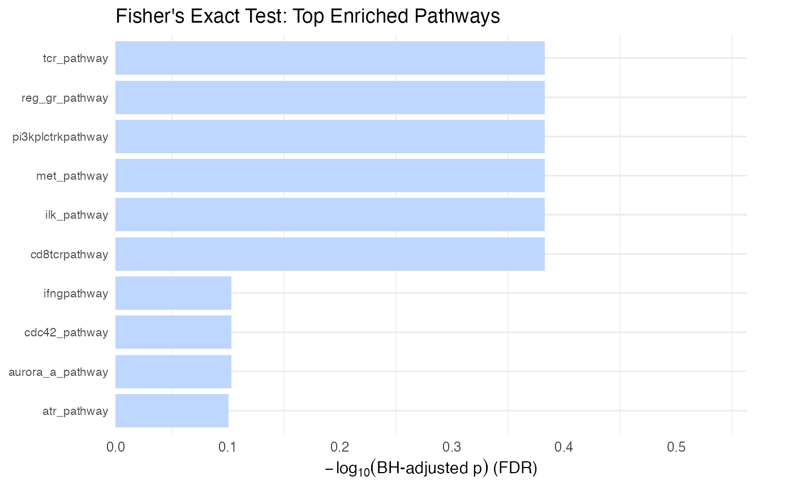
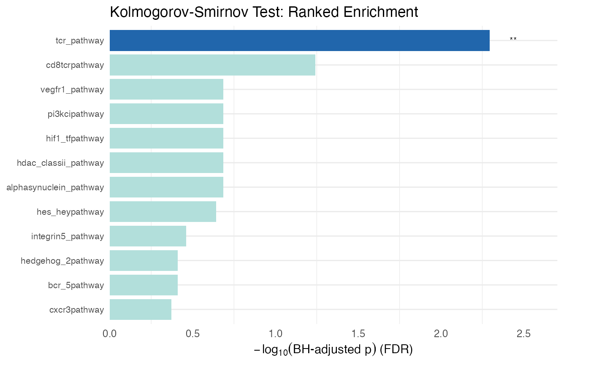
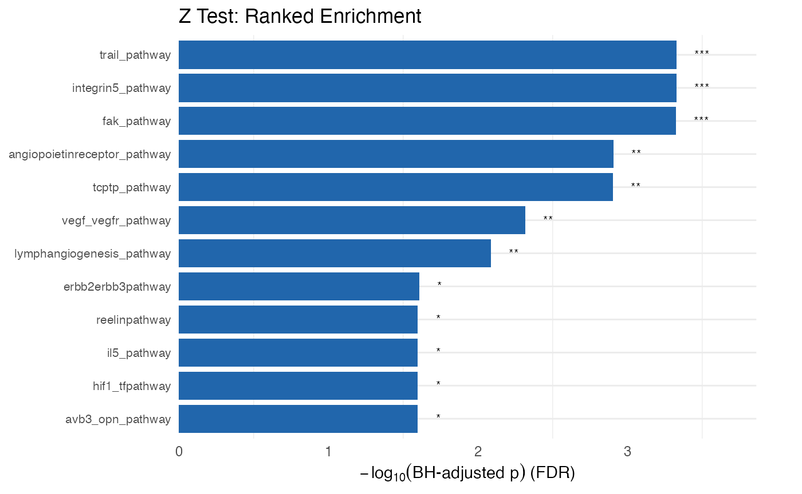
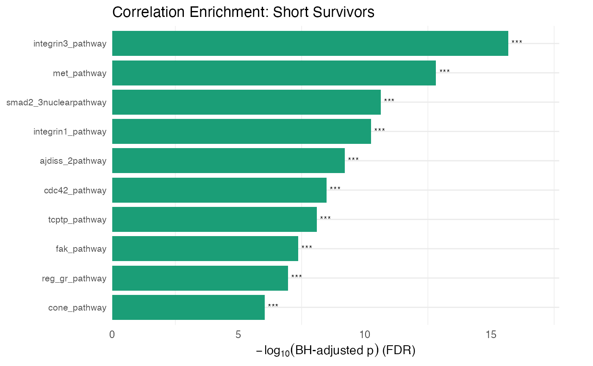
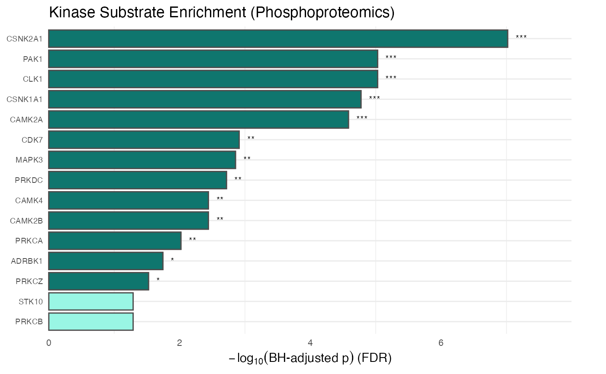
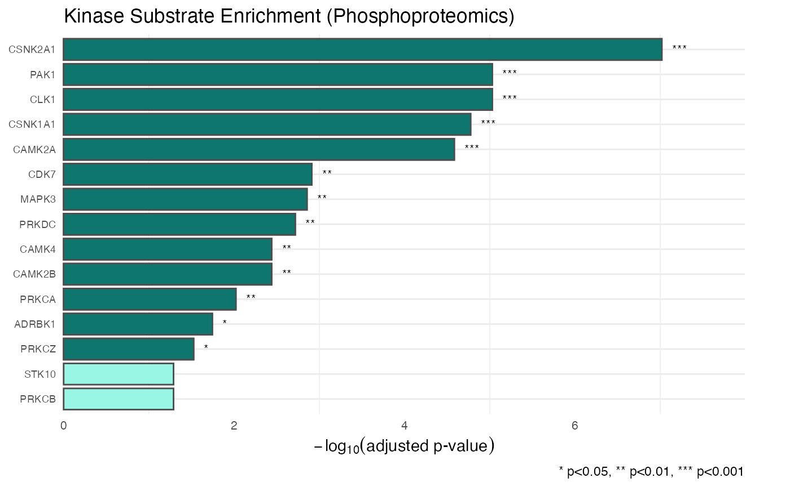

# leapR

## Installation

This is intended to be a short introduction to the `leapR` package.
First we need to load the required libraries:

``` r
# install from bioconductor
if (!require(BiocManager)) {
  install.packages('BiocManager')
  BiocManager::install('leapR')
}
```

## Load libraries needed

``` r
# load the core libraries
library(leapR)
library(gplots)
library(rmarkdown)
# plotting helpers used in this vignette
library(ggplot2)
library(dplyr)
library(tibble)
library(stringr)
library(BiocFileCache)
```

## Introduction

### Definitions

*Dataset* - an expression dataset, contained in the Bioconductor object,
that at the bare minimum has a matrix of components (rows) measured in
the same system under multiple different conditions (columns)

*Component* - the things being measured, genes, proteins, methylation
site, phosphosite, etc. For functional (currently) the component must be
associated with a gene name. That is, there’s not currently a way to
calculate pathway enrichment using lipids.

*Pathway* - a set of components that works together to accomplish
something or are related to each other in some other way. This includes
classic signaling and metabolic pathways, but also molecular function
and localization categories and other groups of related components, like
genome location, conservation, etc.

*Condition* - a sample where the treatment, environmental conditions,
patient, time point or some combination of those is varied.

The overall idea for functional enrichment is to determine which
pathways are statistically over-represented in one group versus another,
display statistically differential abundance from one group to another,
or are statistically differentially distributed in a ranked list based
on the abundance of one sample. Each of these purposes has a different
underlying statistical test (or family of tests) and the results of each
can be interpreted in somewhat different ways. The purpose of this
vignette is to give the user a very brief introduction on how to use the
package, not to discuss the underlying statistical choices that need to
be made when analyzing such data.

There are a number of caveats (probably non-exhaustive) with doing this
kind of analysis.

### Important points for consideration

#### Data normalization

One important point is to use data that’s been normalized in a
particular way to do these analyses. Data here has been normalized as a
Z score *by row* (gene/protein/etc.). So, for each row, calculate the
mean and standard deviation across all the conditions (columns) and then
express as a Z score.

Here’s why. All high-throughput technologies (microarray, RNAseq,
MS-assisted proteomics, metabolomics, lipidomics, etc.) suffer from the
same limitation. The detectability of each molecule being detected
(protein, RNA, etc.) is different and, in general, it’s impossible to
accurately determine *how detectable* each one is. The multi-omic
functional enrichment process lumps together measurements from different
components (proteins, genes, etc.) to summarize a pathway. If the
component measurements aren’t directly comparable (they aren’t) then
this can and will introduce significant systematic errors and won’t
produce the results you’re looking for. Careful consideration must be
given that the results of the analysis reflect the question being asked
and that the normalization method hasn’t obscured the desired results.

#### Background

The background of comparison for functional enrichment is always
important, but it mainly impacts the Fisher’s exact tests in the
examples below. The background answers the question: “My functional
group of interest is statistically enriched relative to what?” For
Fisher’s exact tests this is critical. Generally, it is best to compare
enrichment against the components observed in the data (the experiment’s
universe) rather than the universe of all possible components. For
example, a proteomics dataset from plasma may contain a limited set of
proteins compared with all possible human proteins; using the observed
proteins as the background usually yields more meaningful results. Using
all possible proteins will result in substantially different findings.

#### Multiple hypothesis correction

When testing the statistical significance of differences in a lot of
pathways it’s necessary to correct for multiple hypotheses. This
essentially accounts for the possibility you might see SOMETHING
significant by chance if you just test enough things- so it moves p
values in a less significant direction. The more things you test, the
greater this move will be. So pathway databases with lots of pathways
are affected more by this correction, making it harder to get a
significant result (which is a good thing actually).

#### Pathway databases

Two ‘databases’ (organized text files) are included for pathways. The
example is taken from the NCI’s Pathway Interaction Database (PID) and
covers signaling pathways in human - but is no longer being actively
maintained. They can be loaded as follows:

``` r
data(ncipid)
```

#### Identifiers

The identifiers (gene names, e.g.) for the data input MUST match the
identifiers used in the pathway database. The two included human
databases use the HGNC-approved gene names. Which means your data has to
use the same identifiers.

#### Example data

A sample data set is included that is from the CPTAC study of 169
ovarian tumors. We include the dataset as a object, containing three
assays (transcriptomics, global proteomics, and phosphoproteomics) to
enable interoperability with other tools, and store example file as
`rda` on
[Figshare](https://figshare.com/account/projects/251807/articles/29250845)
as example.

This data can be loaded as follows:

``` r
# Inspect the `pset` SummarizedExperiment.
str(pset)
#> Formal class 'SummarizedExperiment' [package "SummarizedExperiment"] with 5 slots
#>   ..@ colData        :Formal class 'DFrame' [package "S4Vectors"] with 6 slots
#>   .. .. ..@ rownames       : chr [1:174] "TCGA-09-1664" "TCGA-09-2056" "TCGA-13-1404" "TCGA-13-1409" ...
#>   .. .. ..@ nrows          : int 174
#>   .. .. ..@ elementType    : chr "ANY"
#>   .. .. ..@ elementMetadata: NULL
#>   .. .. ..@ metadata       : list()
#>   .. .. ..@ listData       : Named list()
#>   ..@ assays         :Formal class 'SimpleAssays' [package "SummarizedExperiment"] with 1 slot
#>   .. .. ..@ data:Formal class 'SimpleList' [package "S4Vectors"] with 4 slots
#>   .. .. .. .. ..@ listData       :List of 1
#>   .. .. .. .. .. ..$ proteomics: num [1:18632, 1:174] -4.0649 -0.1398 -0.0366 0.768 0.2437 ...
#>   .. .. .. .. .. .. ..- attr(*, "dimnames")=List of 2
#>   .. .. .. .. .. .. .. ..$ : chr [1:18632] "C9orf152" "ELMO2" "RPS11" "CREB3L1" ...
#>   .. .. .. .. .. .. .. ..$ : chr [1:174] "TCGA-09-1664" "TCGA-09-2056" "TCGA-13-1404" "TCGA-13-1409" ...
#>   .. .. .. .. ..@ elementType    : chr "ANY"
#>   .. .. .. .. ..@ elementMetadata: NULL
#>   .. .. .. .. ..@ metadata       : list()
#>   ..@ NAMES          : chr [1:18632] "C9orf152" "ELMO2" "RPS11" "CREB3L1" ...
#>   ..@ elementMetadata:Formal class 'DFrame' [package "S4Vectors"] with 6 slots
#>   .. .. ..@ rownames       : NULL
#>   .. .. ..@ nrows          : int 18632
#>   .. .. ..@ elementType    : chr "ANY"
#>   .. .. ..@ elementMetadata: NULL
#>   .. .. ..@ metadata       : list()
#>   .. .. ..@ listData       : Named list()
#>   ..@ metadata       : list()
dim(SummarizedExperiment::assay(pset, "proteomics"))
#> [1] 18632   174
head(rownames(pset))
#> [1] "C9orf152" "ELMO2"    "RPS11"    "CREB3L1"  "PNMA1"    "MMP2"
head(colnames(pset))
#> [1] "TCGA-09-1664" "TCGA-09-2056" "TCGA-13-1404" "TCGA-13-1409" "TCGA-13-1410"
#> [6] "TCGA-13-1482"
```

We also include some groups of patients to compare stored as R data
objects:

``` r
data(shortlist)
data(longlist)

## columns that we want to use for results

cols_to_display <- c("ingroup_n", "outgroup_n", "background_n", 
                     "pvalue", "BH_pvalue")
```

The data are now loaded and ready to go through some of the examples.

## Examples

We include five examples of how to use this tool, depending on the
analysis at hand. \## Comparison of one condition/group versus another
condition/group.

There are a number of ways to do this. I generally use a simple approach
which assesses the statistical difference in distributions between the
abundance values from all the members of a pathway in all the group
members from one group with those from the other group using a t test.

#### Caveat

This is a ‘bag of values’ approach and it does not pay attention to the
relationships between values in different groups (i.e. that each group
has measurements for the same component). There are likely issues that
rise because of this and caveats associated with it. However, it works
fairly well.

#### Description

In this example we are assessing the enrichment of pathways in a group
of short surviving patients versus in a group of long surviving  
patients. We can also do a single patient-to-patient comparison or
compare a single patient to a group of patients.

#### Interpretation

Better corrected p-values are more enriched. However, you can get good
p-values when the algorithm only considers a limited number of
components from a pathway. That is, the pathway may have 30 members and
the p-value is coming from values from just 3 members. You can look at
the `ingroup_n` column from the result matrix to see this (and screen
out if desired).

It is VERY important to also consider the effect size. That is, the
difference between the mean of one group and the mean of the other
group. If there are large numbers of components in the pathway being
compared it is relatively easy to get a significant p value with small
effect size. Though this may be a real difference it is often not as
interesting as a smaller group with worse p value and greater effect
size. You can look at the effect size by comparing the `ingroup_mean`
and `outgroup_mean` columns.

``` r
# in this example we lump a bunch of patients together (the 'short survivors')
# and compare them to another group (the 'long survivors')

### using enrichment_wrapper function
protdata.enrichment.svl <- leapR::leapR(
  geneset = ncipid,
  enrichment_method = "enrichment_comparison",
  eset = pset,
  assay_name = "proteomics",
  primary_columns = shortlist,
  secondary_columns = longlist
)

or <- order(unlist(protdata.enrichment.svl[, "pvalue"]))
rmarkdown::paged_table(protdata.enrichment.svl[or, cols_to_display])
```

``` r
# another application is to compare just one patient against another
# (this would be the  equivalent of comparing one time point to another)

### using enrichment_wrapper function
protdata.enrichment.svl.ovo <- leapR::leapR(
  geneset = ncipid,
  enrichment_method = "enrichment_comparison",
  eset = pset,
  assay_name = "proteomics",
  primary_columns = shortlist[1],
  secondary_columns = longlist[1]
)
or <- order(unlist(protdata.enrichment.svl.ovo[, "pvalue"]))
rmarkdown::paged_table(protdata.enrichment.svl.ovo[or, cols_to_display])
```

When we only compare one sample to another, we get no enriched pathways.

### Fisher’s exact test

For this test I use Fisher’s exact which is a simple comparison of the
overlap of two sets (think of it like a statistical Venn diagram with
two groups). It’s also referred to as a hypergeometric test.

#### Caveats

*Caveat 1*. Fisher’s exact does not consider abundance values but only
lists of components. Generally this requires some separation of a group
of interest using differential expression, module membership (from a
network for example), or some other method.

*Caveat 2*. The choice of background for comparison can make a big
difference on outcome. For example, in a proteomics experiment where
you’re looking at enrichment in a group of highly differentially
expressed proteins, you could choose to use all possible proteins as a
background, or you could use just those proteins that were observed by
proteomics (generally a much more limited set). The second option is
generally the best since the first options will result in (partly to
mostly) functions that are enriched in proteins that are seen in
proteomics. That is, the most abundant proteins, which is generally not
the desired outcome.

#### Description

In the example below I construct a genelist of interest using a simple
abundance threshold on the data then use a background of all the genes
in the example dataset (which is a limited number). I then do a simple
hierarchical clustering on the data, extract modules, and step through
each module to calculate enrichment for them, outputting the results
into a separate text file.

#### Interpretation

As with the t test comparison above it is important to look at the
number of pathway members included in the comparison (look at the
in_path column). There is no ‘effect size’ problem with Fisher’s exact
since it’s just a set comparison, but it’s important to note that
significant p values can arise from a pathway being *underrepresented*
in the genelist, which often times is not the desired result. The foldx
column gives a ratio of in versus not in the genelist, values \> 1 being
enriched and \<1 being depleted.

``` r
# for this example we will construct a list of genes from the expression data
#     to emulate what you might be inputting
genelist <- rownames(pset)[which(SummarizedExperiment::assay(pset, 
                                                    "proteomics")[, 1] > 0.5)]

protdata.enrichment.sets.test <- leapR::leapR(
  geneset = ncipid,
  enrichment_method = "enrichment_in_sets",
  eset = pset,
  assay_name = "proteomics",
  targets = genelist
)
or <- order(protdata.enrichment.sets.test[, "pvalue"])
rmarkdown::paged_table(protdata.enrichment.sets.test[or, cols_to_display])
```

``` r


# in this example we construct some modules from the hierarchical clustering
#   of the   data
protdata_naf <- SummarizedExperiment::assay(pset, "proteomics")

# hierarchical clustering is not too happy with lots of missing values
#    so we'll do a zero fill on this to get the modules
protdata_naf[which(is.na(protdata_naf))] <- 0

# construct the hierarchical clustering using the 'wardD' method, which
#    seems to give more even sized modules
protdata_hc <- hclust(dist(protdata_naf), method = "ward.D2")

# arbitrarily we'll chop the clusters into 5 modules
modules <- cutree(protdata_hc, k = 5)

## sara: created list
clusters <- lapply(unique(modules), function(x) names(which(modules == x)))

# modules is a named list of values where each value is a module
#         number and the name is the gene name

# To do enrichment for one module (module 1 in this case) do this
protdata.enrichment.sets.module_1 <- leapR::leapR(
  geneset = ncipid,
  enrichment_method = "enrichment_in_sets",
  eset = pset,
  assay_name = "proteomics",
  targets = names(modules[which(modules == 1)])
)

# To do enrichment on all modules and return the list of enrichment results
protdata.enrichment.sets.modules <- do.call(rbind, 
                                            leapR::cluster_enrichment(
                                                eset = pset,
                                                assay_name= 'proteomics',
                                                geneset = ncipid,
                                                clusters = clusters, 
                                                sigfilter = 0.25))
## nothing is enriched
rmarkdown::paged_table(protdata.enrichment.sets.modules[, cols_to_display])
```

##### Visualizing Fisher’s exact results

``` r
# Plot the top enriched gene sets from Fisher's exact test
# Stars indicate significance (None seen here)
plot_leapr_bar(
  protdata.enrichment.sets.test,
  title = "Fisher's Exact Test: Top Enriched Pathways",
  top_n = 10,
  star_thresholds = c(0.05, 0.01, 0.001),
  wrap = 40
)
```



### The Kolmogorov–Smirnov test (KS)

Similar to the popular GSEA, KS tests whether a group of components (the
pathway) is distributed in a statistically significant manner in a
ranked list of components. That is, if all the members of the pathway
are clustered together at the top of the list (highly abundant, e.g.) or
at the bottom of the list (low abundance, e.g.) this will return good p
values. I should note that GSEA uses a more sophisticated approach than
this and their application has a lot of bells and whistles.

#### Description

In the example below I’m simply calculating enrichment for one of the
patients in the list (arbitrarily selected). The ranking value is
relative protein abundance in this case, but can be any continuous
measure or derived value. For example, you could calculate the topology
of all proteins in a network and use the topology measure (degree) as
the measure.

#### Interpretation

Similar to the other examples be cautious of pathways with good p values
that consider a small number of pathway numbers (in_path column). The
MeanPath column gives a measure that shows how far above or below the
median the mean rank of the pathway is (normalized to -1,1). The Zscore
column is a Zscore calculated on the basis of the mean percentage rank
of the pathway relative to the mean of the entire list divided by the
standard deviation of the pathway rank. The foldx column expresses the
mean percentage rank of the pathway relative to the entire list - closer
to 0 is higher in the list and closer to 1 is closer to the bottom of
the list. Each of these should give consistent results, but will be
somewhat different.

``` r
# This is how you calculate enrichment in a ranked list 
# (for example from topology)
### using enrichment_wrapper function
protdata.enrichment.order <- leapR::leapR(
  geneset = ncipid, "enrichment_in_order",
  eset = pset,
  method = 'ks',
  assay_name = "proteomics",
  primary_columns = shortlist[1]
)


or <- order(protdata.enrichment.order[, "pvalue"])
rmarkdown::paged_table(protdata.enrichment.order[or, cols_to_display])
```

##### Visualizing KS test results

``` r
# Plot the ranked enrichment results
plot_leapr_bar(
  protdata.enrichment.order,
  title = "Kolmogorov-Smirnov Test: Ranked Enrichment",
  top_n = 12,
  fill_sig = "#2166AC",
  fill_ns = "#B2DFDB",
  wrap = 38
)
```



#### KS alternative: the one-sample Z test

Given that the KS test [has not always been the best for gene set
enrichment](https://pnnl.github.io/leapR/articles/) we also implement
the one-sample z test.

``` r
# This is how you calculate enrichment in a ranked list 
# (for example from topology)
### using enrichment_wrapper function
protdata.enrichment.order <- leapR::leapR(
  geneset = ncipid, "enrichment_in_order",
  eset = pset,
  method = 'ztest',
  assay_name = "proteomics",
  primary_columns = shortlist[1]
)


or <- order(protdata.enrichment.order[, "pvalue"])
rmarkdown::paged_table(protdata.enrichment.order[or, cols_to_display])
```

``` r

plot_leapr_bar(
  protdata.enrichment.order,
  title = "Z Test: Ranked Enrichment",
  top_n = 12,
  fill_sig = "#2166AC",
  fill_ns = "#B2DFDB",
  wrap = 38
)
```



### Enrichment in Correlation

The idea here is to use the correlation of pathway members to each other
versus to non-pathway members as a way to assess functional enrichment.
This idea seems sound- pathways that are varying in a correlated way
across a bunch of conditions (say time points or patients) may be more
active and more important than others. However, more testing and
validation is needed to show that this is the case.

#### Interpretation

The `ingroup_mean` gives the mean correlation of the pathway members to
each other and outgroup_mean gives the correlation of the pathway
members to non-pathway members. Background_mean gives the mean
correlation of all non-pathway members. The `pvalue` and `BH_pvalue` are
for the pathway members to each other versus those pathway members to
non-pathway components. The `pvalue_background` and
`BH_pvalue_background` are for the pathway member correlation relative
to non-pathway member correlation (which is similar but slightly
different than the other p-values).

``` r
### using enrichment_wrapper function
protdata.enrichment.correlation <- leapR::leapR(
  geneset = ncipid,
  enrichment_method = "correlation_enrichment",
  assay_name = "proteomics",
  eset = pset
)

or <- order(protdata.enrichment.correlation[, "pvalue"])
rmarkdown::paged_table(head(protdata.enrichment.correlation[or, 
                                                      cols_to_display]))
```

``` r

protdata.enrichment.correlation.short <- leapR::leapR(
  geneset = ncipid,
  enrichment_method = "correlation_enrichment",
  assay_name = "proteomics",
  eset = pset[, shortlist]
)
or <- order(protdata.enrichment.correlation.short[, "pvalue"])
rmarkdown::paged_table(head(protdata.enrichment.correlation.short[or, 
                                                        cols_to_display]))
```

``` r

protdata.enrichment.correlation.long <- leapR::leapR(
  geneset = ncipid,
  enrichment_method = "correlation_enrichment",
  assay_name = "proteomics",
  eset = pset[, longlist]
)
or <- order(protdata.enrichment.correlation.long[, "pvalue"])
rmarkdown::paged_table(head(protdata.enrichment.correlation.long[or, 
                                                            cols_to_display]))
```

##### Visualizing correlation enrichment results

``` r
# Compare correlation patterns across conditions
plot_leapr_bar(
  protdata.enrichment.correlation.short,
  title = "Correlation Enrichment: Short Survivors",
  top_n = 10,
  fill_sig = "#1B9E77",
  fill_ns = "#D8F0E8",
  wrap = 36
)
```



### Phosphoproteomics data analysis

In this example we will use phosphoproteomics data to assess the
enrichment in known kinase substrates (a proxy for kinase activity)

``` r
data("kinasesubstrates")

# for an individual tumor calculate the Kinase-Substrate 
# Enrichment (similar to KSEA)
#     This uses the site-specific phosphorylation data to determine 
# which kinases
#     might be active by assessing the enrichment of the 
# phosphorylation of their known substrates

phosphodata.ksea.order <- leapR::leapR(
  geneset = kinasesubstrates,
  enrichment_method = "enrichment_in_order",
  assay_name = "phosphoproteomics",
  eset = phset,
  method = 'ztest', 
  primary_columns = "TCGA-13-1484")

or <- order(phosphodata.ksea.order[, "pvalue"])
rmarkdown::paged_table(phosphodata.ksea.order[or, cols_to_display])
```

``` r


# now do the same thing but use a threshold
phosphodata.sets.order <- leapR::leapR(
  geneset = kinasesubstrates,
  enrichment_method = "enrichment_in_sets",
  eset = phset,
  assay_name = "phosphoproteomics",
  threshold = 0.5,
  primary_columns = "TCGA-13-1484"
)
or <- order(phosphodata.sets.order[, "pvalue"])
rmarkdown::paged_table(phosphodata.sets.order[or, cols_to_display])
```

##### Visualizing kinase substrate enrichment

``` r
plot <- plot_leapr_bar(
  phosphodata.sets.order,
  title            = "Kinase Substrate Enrichment (Phosphoproteomics)",
  top_n            = 15,
  star_thresholds  = c(0.05, 0.01, 1e-3),
  wrap             = 36,
  fill_sig         = "#0F766E",  # dark teal for significant
  fill_ns          = "#99F6E4",  # light teal for non-significant
  outline          = "grey30",
  axis_text_y_size = 7,
  axis_text_x_size = 8
)

plot
```



``` r

# You can also modify the plot further using standard ggplot2 arguments
plot + ggplot2::labs(
  y = expression(-log[10]("adjusted p-value")),
  caption = "* p<0.05, ** p<0.01, *** p<0.001"
)
```



Lastly we print out the session info!

``` r
sessionInfo()
#> R version 4.5.2 (2025-10-31)
#> Platform: aarch64-apple-darwin20
#> Running under: macOS Tahoe 26.3.1
#> 
#> Matrix products: default
#> BLAS:   /System/Library/Frameworks/Accelerate.framework/Versions/A/Frameworks/vecLib.framework/Versions/A/libBLAS.dylib 
#> LAPACK: /Library/Frameworks/R.framework/Versions/4.5-arm64/Resources/lib/libRlapack.dylib;  LAPACK version 3.12.1
#> 
#> locale:
#> [1] en_US.UTF-8/en_US.UTF-8/en_US.UTF-8/C/en_US.UTF-8/en_US.UTF-8
#> 
#> time zone: America/Los_Angeles
#> tzcode source: internal
#> 
#> attached base packages:
#> [1] stats     graphics  grDevices utils     datasets  methods   base     
#> 
#> other attached packages:
#>  [1] BiocFileCache_3.0.0 dbplyr_2.5.1        stringr_1.6.0      
#>  [4] tibble_3.3.1        dplyr_1.1.4         ggplot2_4.0.1      
#>  [7] rmarkdown_2.30      gplots_3.3.0        leapR_0.99.9       
#> [10] BiocStyle_2.38.0   
#> 
#> loaded via a namespace (and not attached):
#>  [1] SummarizedExperiment_1.40.0 gtable_0.3.6               
#>  [3] httr2_1.2.2                 xfun_0.56                  
#>  [5] bslib_0.10.0                htmlwidgets_1.6.4          
#>  [7] caTools_1.18.3              Biobase_2.70.0             
#>  [9] lattice_0.22-7              tzdb_0.5.0                 
#> [11] vctrs_0.7.1                 tools_4.5.2                
#> [13] bitops_1.0-9                generics_0.1.4             
#> [15] curl_7.0.0                  stats4_4.5.2               
#> [17] RSQLite_2.4.5               blob_1.3.0                 
#> [19] pkgconfig_2.0.3             Matrix_1.7-4               
#> [21] KernSmooth_2.23-26          RColorBrewer_1.1-3         
#> [23] S7_0.2.1                    desc_1.4.3                 
#> [25] S4Vectors_0.48.0            lifecycle_1.0.5            
#> [27] compiler_4.5.2              farver_2.1.2               
#> [29] textshaping_1.0.4           Seqinfo_1.0.0              
#> [31] htmltools_0.5.9             sass_0.4.10                
#> [33] yaml_2.3.12                 pkgdown_2.2.0              
#> [35] pillar_1.11.1               jquerylib_0.1.4            
#> [37] DelayedArray_0.36.0         cachem_1.1.0               
#> [39] abind_1.4-8                 gtools_3.9.5               
#> [41] tidyselect_1.2.1            digest_0.6.39              
#> [43] stringi_1.8.7               purrr_1.2.1                
#> [45] bookdown_0.46               labeling_0.4.3             
#> [47] fastmap_1.2.0               grid_4.5.2                 
#> [49] cli_3.6.5                   SparseArray_1.10.8         
#> [51] magrittr_2.0.4              S4Arrays_1.10.1            
#> [53] readr_2.1.6                 withr_3.0.2                
#> [55] filelock_1.0.3              rappdirs_0.3.4             
#> [57] scales_1.4.0                bit64_4.6.0-1              
#> [59] XVector_0.50.0              matrixStats_1.5.0          
#> [61] bit_4.6.0                   otel_0.2.0                 
#> [63] ragg_1.5.0                  hms_1.1.4                  
#> [65] memoise_2.0.1               evaluate_1.0.5             
#> [67] knitr_1.51                  GenomicRanges_1.62.1       
#> [69] IRanges_2.44.0              rlang_1.1.7                
#> [71] DBI_1.2.3                   glue_1.8.0                 
#> [73] BiocManager_1.30.27         BiocGenerics_0.56.0        
#> [75] rstudioapi_0.18.0           jsonlite_2.0.0             
#> [77] R6_2.6.1                    MatrixGenerics_1.22.0      
#> [79] systemfonts_1.3.1           fs_1.6.6
```
